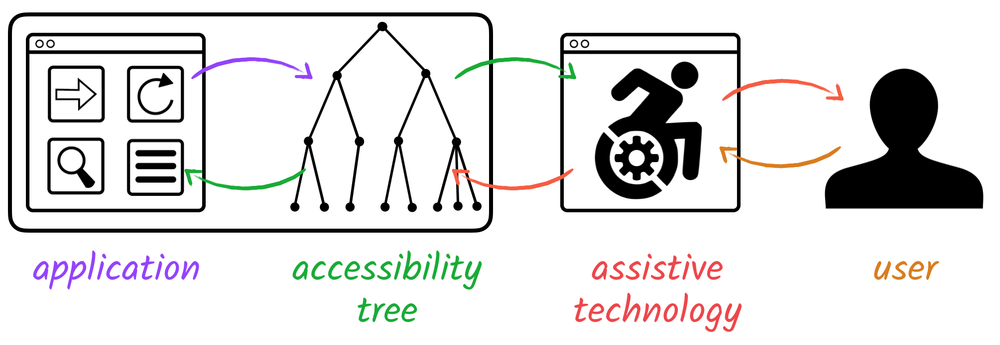
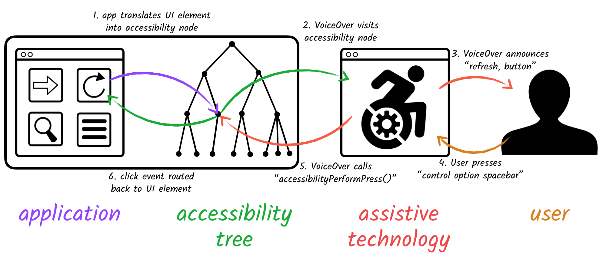
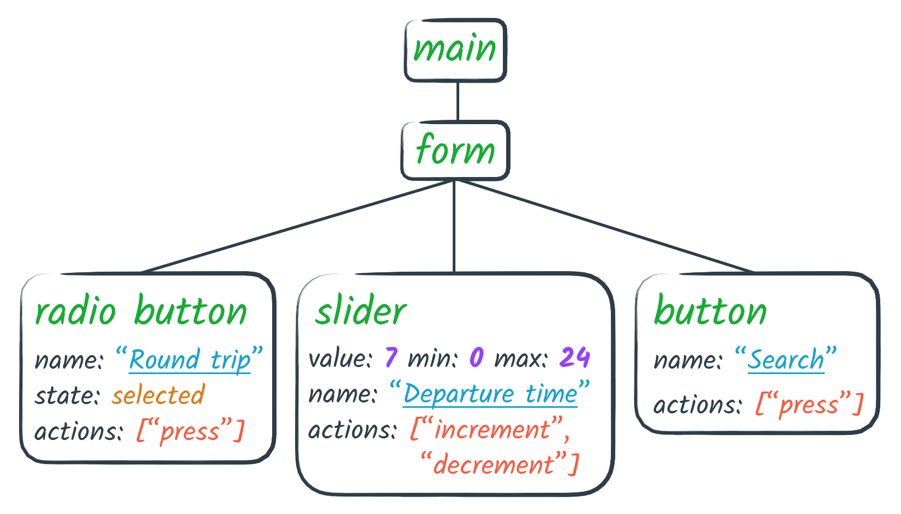
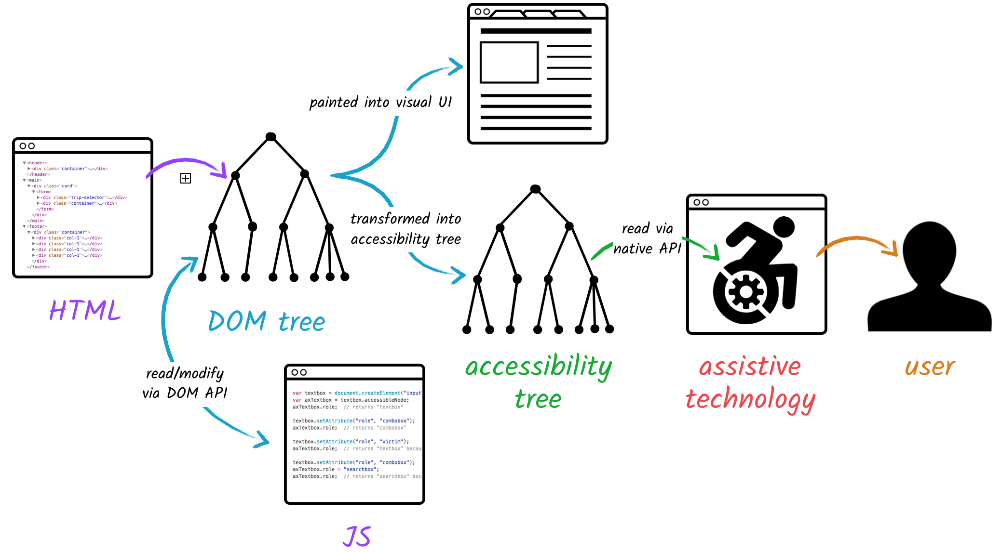
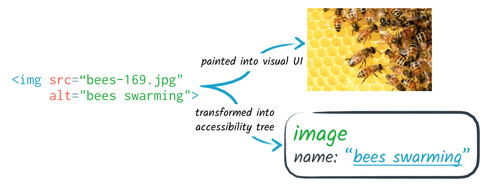
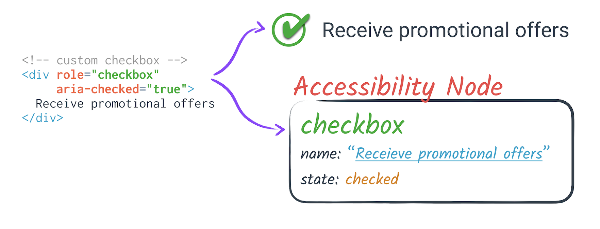
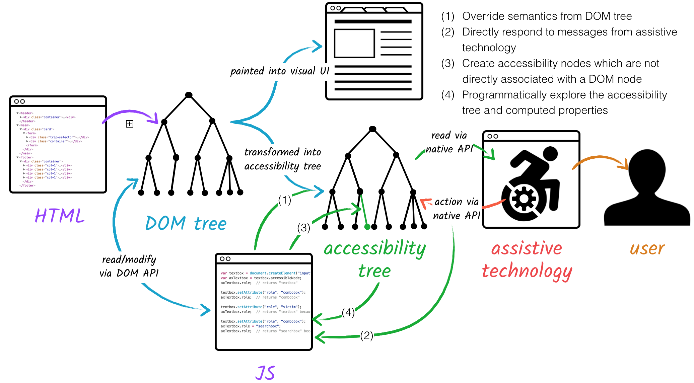

# Accessibility Object Model

**Authors:**

* Alice Boxhall, Google, aboxhall@google.com
* James Craig, Apple, jcraig@apple.com
* Dominic Mazzoni, Google, dmazzoni@google.com
* Alexander Surkov, Mozilla, surkov.alexander@gmail.com

<!-- START doctoc generated TOC please keep comment here to allow auto update -->
<!-- DON'T EDIT THIS SECTION, INSTEAD RE-RUN doctoc TO UPDATE -->
**Table of Contents**

- [Introduction](#introduction)
- [Background: assistive technology and the accessibility tree](#background-assistive-technology-and-the-accessibility-tree)
  - [Accessibility node properties](#accessibility-node-properties)
- [DOM tree, accessibility tree and platform accessibility APIs](#dom-tree-accessibility-tree-and-platform-accessibility-apis)
  - [Mapping native HTML to the accessibility tree](#mapping-native-html-to-the-accessibility-tree)
  - [ARIA](#aria)
- [Gaps in the web platform's accessibility story](#gaps-in-the-web-platforms-accessibility-story)
- [The Accessibility Object Model](#the-accessibility-object-model)
  - [Phase 1: Modifying Accessible Properties](#phase-1-modifying-accessible-properties)
    - [Use cases for Accessible Properties](#use-cases-for-accessible-properties)
    - [AOM does not reflect to ARIA](#aom-does-not-reflect-to-aria)
    - [AOM takes precedence](#aom-takes-precedence)
    - [Reasoning](#reasoning)
    - [Reading properties in phase 1](#reading-properties-in-phase-1)
  - [Phase 2: Querying author-provided semantics](#phase-2-querying-author-provided-semantics)
    - [ARIA does reflect to AOM](#aria-does-reflect-to-aom)
    - ["dirty value flag" model](#dirty-value-flag-model)
    - [Reasoning](#reasoning-1)
    - [Validation](#validation)
    - [Computed accessible properties](#computed-accessible-properties)
  - [Phase 3: Accessible Actions](#phase-3-accessible-actions)
  - [Phase 4: Virtual Accessibility Nodes](#phase-4-virtual-accessibility-nodes)
  - [Phase 5: Full Introspection of an Accessibility Tree](#phase-5-full-introspection-of-an-accessibility-tree)
    - [Why is accessing the computed properties being addressed last?](#why-is-accessing-the-computed-properties-being-addressed-last)
  - [Phases: Summary](#phases-summary)
  - [Audience for the proposed API](#audience-for-the-proposed-api)
- [Next Steps](#next-steps)
  - [Incubation](#incubation)
- [Additional thanks](#additional-thanks)
- [Appendix: `AccessibleNode` naming](#appendix-accessiblenode-naming)

<!-- END doctoc generated TOC please keep comment here to allow auto update -->

## Introduction

This effort aims to create a JavaScript API
to allow developers to modify (and eventually explore) the accessibility tree
for an HTML page.

If you're already familiar with the accessibility tree and ARIA,
[The Accessibility Object Model](#the-accessibility-object-model)
section is the discussion of the actual proposal.

## Background: assistive technology and the accessibility tree

Assistive technology, in this context, refers to a third party application
which augments or replaces the existing UI for an application.
One well-known example is a screen reader,
which replaces the visual UI and pointer-based UI
with an auditory output (speech and tones)
and a keyboard and/or gesture-based input mechanism.

Many assistive technologies interact with a web page via accessibility APIs, such as
[UIAutomation](https://msdn.microsoft.com/en-us/library/windows/desktop/ee684009.aspx)
on Windows, or
[NSAccessibility](https://developer.apple.com/library/mac/documentation/AppKit/Reference/NSAccessibility_Protocol_Reference/)
on OS X.
These APIs allow an application to expose a tree of objects representing the application's interface,
typically with the root node representing the application window,
with various levels of grouping node descendants down to individual interactive elements.
This is referred to as the **accessibility tree**.

An assistive technology user interacts with the application almost exclusively via this API,
as the assistive technology uses it both to create the alternative interface,
and to route user interaction events triggered by the user's commands to the assistive technology.



Both the alternative interface's *output*
(e.g. speech and tones,
updating a [braille display](https://en.wikipedia.org/wiki/Refreshable_braille_display),
moving a [screen magnifier's](https://en.wikipedia.org/wiki/Screen_magnifier) focus)
and *input*
(e.g. keyboard shortcuts, gestures, braille routing keys,
[switch devices](https://en.wikipedia.org/wiki/Switch_access), voice input)
are completely the responsibility of the assistive technology,
and are abstracted away from the application.

For example, a [VoiceOver](https://www.apple.com/voiceover/info/guide/) user
interacting with a native application on OS X
might press the key combination
"Control Option Spacebar" to indicate that they wish to click the UI element which the screen reader is currently visiting.



These keypresses would never be passed to the application,
but would be interpreted by the screen reader,
which would then call the
[`accessibilityPerformPress()`](https://developer.apple.com/reference/appkit/nsaccessibilitybutton/1525542-accessibilityperformpress?language=objc)
function on the accessibility node representing the UI element in question.
The application can then handle the press action;
typically, this routes to the code which would handle a click event.

Accessibility APIs are also popular for testing and automation.
They provide a way to examine an application's state and manipulate its UI from out-of-process,
in a robust and comprehensive way.
While assistive technology for users with disabilities
is typically the primary motivator for accessibility APIs,
it's important to understand that these APIs are quite general
and have many other uses.

### Accessibility node properties

Each node in the accessibility tree may be referred to as an **accessibility node**.
An accessibility node always has a **role**, indicating its semantic purpose.
This may be a grouping role,
indicating that this node merely exists to contain and group other nodes,
or it may be an interactive role,
such as `"button"`.



The user, via assistive technology, may explore the accessibility tree at various levels.
They may interact with grouping nodes,
such as a landmark element which helps a user navigate sections of the page,
or they may interact with interactive nodes,
such as a button.
In both of these cases,
the node will usually need to have a **label** (often referred to as a **name**)
to indicate the node's purpose in context.
For example, a button may have a label of "Ok" or "Menu".

Accessibility nodes may also have other properties,
such as the current **value**
(e.g. `"10"` for a range, or `"Jane"` for a text input),
or **state** information
(e.g. `"checked"` for a checkbox, or `"focused"`).

Interactive accessibility nodes may also have certain **actions** which may be performed on them.
For example, a button may expose a `"press"` action, and a slider may expose
`"increment"` and `"decrement"` actions.

These properties and actions are referred to as the *semantics* of a node.
Each accessibility API expresses these concepts slightly differently,
but they are all conceptually similar.

##  DOM tree, accessibility tree and platform accessibility APIs

The web has rich support for making applications accessible,
but only via a *declarative* API.

The DOM tree is translated, in parallel,
into the primary, visual representation of the page,
and the accessibility tree,
which is in turn accessed via one or more *platform-specific* accessibility APIs.



Some browsers support multiple accessibility APIs across different platforms,
while others are specific to one accessibility API.
However, any browser that supports at least one native accessibility API
has some mechanism for exposing a tree structure of semantic information.
We refer to that mechanism, regardless of implementation details,
as the **accessibility tree** for the purposes of this API.

### Mapping native HTML to the accessibility tree

Native HTML elements are implicitly mapped to accessibility APIs.
For example, an  `` element will automatically be mapped
to an accessibility node with a role of `"image"`
and a label based on the `alt` attribute (if present).




### ARIA

Alternatively, [ARIA](https://www.w3.org/TR/wai-aria-1.1/)
allows developers to annotate elements with attributes to override
the default role and semantic properties of an element -
but not to expose any accessible actions.



In either case there's a one-to-one correspondence
between a DOM node and a node in the accessibility tree,
and there is minimal fine-grained control over the semantics of the corresponding accessibility node.

## Gaps in the web platform's accessibility story

Web apps that push the boundaries of what's possible on the web struggle to make them accessible
because the APIs aren't yet sufficient -
in particular, they are much less expressive than the native APIs that the browser communicates with.

In the description of each of the phases of the Accessibility Object Model
spec below, we discuss specific gaps -
things that currently can't be achieved using current web accessibility APIs,
or can't be achieved without cumbersome workarounds.

## The Accessibility Object Model

This spec proposes the *Accessibility Object Model* (AOM).
We plan to split this work into four phases,
which will respectively allow authors to:

1. modify the semantic properties of the accessibility node associated with a particular DOM node,
2. read back the _author-provided_ semantic properties which have been set via ARIA
  or via the phase 1 object, 
3. directly respond to events (or actions) from assistive technology,
4. create virtual accessibility nodes which are not directly associated with a DOM node, and
5. programmatically explore the accessibility tree
   and access the computed properties of accessibility nodes.

In the following sections we'll outline each of these phases.

### Phase 1: Modifying Accessible Properties

This phase will explain and augment the existing capabilities of
[ARIA](https://www.w3.org/TR/wai-aria-1.1/).

Using ARIA, it's possible to override and add to the default semantic values for an element:

```html
<div role="checkbox" aria-checked="true">Receive promotional offers</div>
```

In this example,
the [default role of a `<div>`](https://www.w3.org/TR/html-aam-1.0/#el-div),
which would usually be assigned a grouping role or excluded from the accessibility tree,
is overridden to give the accessibility node associated with this element
a role of `checkbox`.

Furthermore, the
[default value of the accessible `checked` property](https://www.w3.org/TR/wai-aria/states_and_properties#aria-checked)
is overridden to expose the element as a "checked checkbox".

**The first phase of AOM, *Accessible Properties*,
would create a different mechanism to achieve the same result:**

```js
el.accessibleNode.role = "checkbox";  // (See link below for naming concerns)
el.accessibleNode.checked = true;
```

(There are some [notes on `accessibleNode` naming](#appendix-accessiblenode-naming).)


#### Use cases for Accessible Properties

Accessible Properties would avoid Custom Elements needing to "sprout" attributes in order to express their own semantics.

Today, a library author creating a custom element is forced to "sprout" ARIA attributes
to express semantics which are implicit for native elements.

```html
<!-- Page author uses the custom element as they would a native element -->
<custom-slider min="0" max="5" value="3"></custom-slider>

<!-- Custom element is forced to "sprout" extra attributes to express semantics -->
<custom-slider min="0" max="5" value="3" role="slider"
               tabindex="0" aria-valuemin="0" aria-valuemax="5"
               aria-valuenow="3" aria-valuetext="3"></custom-slider>
```

Using AOM, a Custom Element author would be able to write a class declaration like this:

```js
class CustomCheckbox extends HTMLElement {
  constructor() {
    super();

    // Apply a role of "checkbox" via the AOM
    this.accessibleNode.role = "checkbox";
  }

  // Observe the custom "checked" attribute
  static get observedAttributes() { return ["checked"]; }

  // When the custom "checked" attribute changes,
  // keep the accessible checked state in sync.
  attributeChangedCallback(name, oldValue, newValue) {
    switch(name) {
    case "checked":
      this.accessibleNode.checked = (newValue !== null);
    }
  }

  connectedCallback() {
    // When the custom checkbox is inserted in the page,
    // ensure the checked state is in sync with the checked attribute.
    this.accessibleNode.checked = this.hasAttribute("checked");
  }
}

customElements.define("custom-checkbox", CustomCheckbox);
```

From the perspective of the embedding page, a custom checkbox would now
have this clean HTML, with the accessibility fully encapsulated into
the implementation rather than exposed as a leaky abstraction:

```html
<custom-checkbox checked>Receive promotional offers</custom-checkbox>
```

Furthermore, writing Accessible Properties would allow specifying accessible relationships without requiring IDREFs,
as authors can now pass object references.
Currently attributes like aria-describedby and aria-activedescendant
take one or more IDREFs, like this:

```html
<div role="listbox" aria-describedby="id1 id2" aria-activedescendant="id3">
```

Accessible Properties would allow passing object references instead:

```js
el.accessibleNode.describedBy = [accessibleNode1, accessibleNode2];
el.accessibleNode.activeDescendant = accessibleNode3;
```

Moreover, writing Accessible Properties would enable authors using Shadow DOM
to specify relationships which cross over Shadow DOM boundaries.

Today, an author attempting to express a relationship across Shadow DOM boundaries
might attempt using `aria-activedescendant` like this:
```html
<custom-combobox>
  #shadow-root
  |  <!-- this doesn't work! -->
  |  <input aria-activedescendant="opt1"></input>
  |  <slot></slot>
  <custom-optionlist>
    <x-option id="opt1">Option 1</x-option>
    <x-option id="opt2">Option 2</x-option>
    <x-option id='opt3'>Option 3</x-option>
 </custom-optionlist>
</custom-combobox>
```

This fails, because IDREFs are scoped within the shadowRoot
or document context in which they appear.

Using Accessible Properties,
an author could specify this relationship programmatically instead:

```js
const input = comboBox.shadowRoot.querySelector("input");
const optionList = comboBox.querySelector("custom-optionlist");
input.accessibleNode.activeDescendant = optionList.accessibleNode;
```

This would allow the relationship to be expressed naturally.

#### AOM does not reflect to ARIA

Setting a property on `accessibleNode`
does not modify the corresponding ARIA attribute.

```html
clickBtn.accessibleNode.role = "link";

console.log(clickBtn.getAttribute("role"));  // Still "button"
```

#### AOM takes precedence

In the case where and AOM Accessible Property
and the corresponding ARIA attribute
have different values,
the AOM (`accessibleNode`) property takes precedence.

```html
<div "clickBtn" role="button">Click here</div>
```

```js
clickBtn.accessibleNode.role = "link";
```

For example, in the above case,
`clickBtn` would have a computed role of `"link"`
even though its `"role"` attribute is `"button"`.

#### Reasoning

- Not reflecting from `accessibleNode` back to ARIA means:
  - There is no need to handle cases such as related nodes where Accessible Properties
can express things which ARIA cannot;
  - Setting Accessible Properties will not have the performance implications
of setting a DOM attribute.
- `accessibleNode` properties taking precedence means:
  - authors do not need to explicitly remove ARIA attributes
  to ensure `accessibleNode` properties apply,
  - `accessibleNode` provides the maximum value and
  can be a single touch point for defining semantics

#### Reading properties in phase 1

In phase 1, querying the `accessibleNode` object is not possible.
Attempting to read any of the properties on `accessibleNode`
will cause an exception.

```js
console.log(element.accessibleNode.role);  // throws exception
```

### Phase 2: Querying author-provided semantics

Phase 2 will allow reading back author-set semantics
via the `accessibleNode` object.

```js
console.log(element.accessibleNode.role);  // returns author-set role
```

#### ARIA does reflect to AOM

An ARIA attribute is reflected to the corresponding `accessibleNode` property:

```html
<div "clickBtn" role="button">Click here</div>
```

```js
console.log(clickBtn.accessibleNode.role);   // "button"
```

#### "dirty value flag" model

In order for the `accessibleNode` properties to always take precedence,
while also reflecting ARIA attributes from the DOM,
they will follow the
[dirty value flag](https://html.spec.whatwg.org/multipage/forms.html#concept-fe-dirty)
model used by `input`.

This means that once a value has been written to an `accessibleNode`,
the corresponding ARIA attribute *will never be read again*
in the accessibility tree computation process,
even if the value on `accessibleNode` is set to `null`.

```html
<div id="promo" role="checkbox" aria-checked="true">Receive promotional offers</div>
```

```js
console.log(promo.accessibleNode.role);  // "checkbox", reflected from DOM
promo.accessibleNode.role = "switch";
console.log(promo.accessibleNode.role);  // now "switch"
promo.accessibleNode.role = null;
console.log(promo.accessibleNode.role);  // now `null`
```

#### Reasoning

Again, more details reasoning is discussed in #60,
but in summary the benefits are:
- Reflecting from ARIA DOM attributes to `accessibleNode` means that
authors can read ARIA attributes without using getAttribute(),
which improves the ergonomics of ARIA;
- The "dirty value flag" model results logically from the one-way reflection
  from ARIA attributes to `accessibilityNode` properties,
  while having `accessibilityNode` properties take strict precedence.
  - Without this model,
  it would be ambiguous what should happen when setting an `accessibilityNode` property
  to `null`: should it stay `null`, or go back to reflecting the ARIA attribute?
  - And if the latter, how would you ever override the ARIA attribute to get back to a default value?

#### Validation

The ARIA spec defines a
[finite list of value types](https://www.w3.org/TR/wai-aria-1.1/#propcharacteristic_value)
which a particular ARIA attribute may take.

Where these types have a clear 
[mapping](https://www.w3.org/TR/wai-aria-1.1/#typemapping) 
on to a basic JavaScript type,
for example "true/false" which maps directly to a boolean type,
the `accessibleNode` property can be set to that type.

```js
el.accessibleNode.disabled = true;
console.log(el.accessibleNode.disabled); // true
el.accessibleNode.disabled = "false";
console.log(el.accessibleNode.disabled); // true - "false" is truthy

cell.accessibleNode.rowIndex = 5;
console.log(cell.accessibleNode.rowIndex); // 5
cell.accessibleNode.rowIndex = 5.7;
console.log(cell.accessibleNode.rowIndex); // 6 - rounded 
cell.accessibleNode.rowIndex = "5.7";
console.log(cell.accessibleNode.rowIndex); // 5 - parsed
```

For ARIA attributes which take
a _true/false/undefined, _tristate_, _token_ or _token list_ value,
the `accessibleNode` property type will be a `string`,
but only a _valid token value_ may be set.

```js
el.accessibleNode.sort = "ascending";  // ok
console.log(el.accessibleNode.sort);   // "ascending"
el.accessibleNode.sort = "down";       // not ok
console.log(el.accessibleNode.sort);   // `null`
``` 

Querying an Accessible Property can thus be used
as a limited form of **validation** and **feature detection**.

On an uninitialized `AccessibleNode`,
properties that are supported by the browser will return `null` initially,
while unsupported / unrecognized properties return `undefined`:

```js
console.log(el.accessibleNode.role);          // null
console.log(el.accessibleNode.label);         // null
console.log(el.accessibleNode.bodyMassIndex); // undefined
```

When setting the value of an accessible property, that value can
be subsequently retrieved, but only if set to something valid:

```js
el.accessibleNode.role = "button";
console.log(el.accessibleNode.role);      // "button"

el.accessibleNode.role = "banana";
console.log(el.accessibleNode.role);      // null

el.accessibleNode.role = "banana button";
console.log(el.accessibleNode.role);      // "button"
```

If a later spec added "banana" as a valid role,
and a particular browser supported it,
that string would be returned in the second two cases.
This gives web developers a way to do some feature detection
and learn exactly which accessible properties are supported
in a particular browser version.

#### Computed accessible properties

Accessible Properties explicitly **will not** allow authors to access
the _computed_ accessible node properties corresponding to a given DOM node:

```html
<button id="composeBtn">Compose</button>
```
```js
var composeBtn = document.getElementById('composeBtn');
console.log(composeBtn.accessibleNode.role);  // null, not "button"
console.log(composeBtn.accessibleNode.label);  // null, not "Compose"
```

This is analogous to the `style` attribute,
which allows reading and setting an element's local style,
while `getComputedStyle()` allows access to the full computed style.

[Phase 4](#phase-4-full-introspection-of-an-accessibility-tree) will allow accessing the computed properties.

### Phase 3: Accessible Actions

**Accessible Actions** will allow authors to react to user input events coming from assistive technology.

For example:

* A user may be using voice control software and they may speak the name of a
  button somewhere in a web page.
  The voice control software finds the button matching that name in the
  accessibility tree and sends an *action* to the browser to click on that button.
* That same user may then issue a voice command to scroll down by one page.
  The voice control software finds the root element for the web page and sends
  it the scroll *action*.
* A mobile screen reader user may navigate to a slider, then perform a gesture to
  increment a range-based control.
  The screen reader sends the browser an increment *action* on the slider element
  in the accessibility tree.

Currently, browsers implement partial support by accessible actions either by
implementing built-in support for native HTML elements (for example, a native
HTML `<input type="range">` already supports increment and decrement actions,
and text boxes already support actions to set the value or insert text.

However, there is no way for web authors to listen to accessible actions on
custom elements.  For example, the custom slider above with a role of `slider`
prompts a suggestion on VoiceOver for iOS to perform swipe gestures to increment
or decrement, but there is no way to handle that semantic event via any web API.

Accessible Actions gives web developers a mechanism to listen for accessible
actions directly, by adding event listeners on an `AccessibleNode`.
This is analogous to listening for user interaction events on a DOM node,
except that the interaction event arrives via an assistive technology API,
so it is directed to the accessible node first.

For example, to implement a custom slider, the author could simply listen for
`increment` and `decrement` events.

```js
customSlider.accessibleNode.addEventListener('increment', function() {
  customSlider.value += 1;
});
customSlider.accessibleNode.addEventListener('decrement', function() {
  customSlider.value -= 1;
});
```

The supported actions would include:

* `click`
* `contextmenu`
* `focus`
* `setvalue`
* `increment`
* `decrement`
* `select`
* `scroll`
* `dismiss`


### Phase 4: Virtual Accessibility Nodes

**Virtual Accessibility Nodes** will allow authors
to expose "virtual" accessibility nodes,
which are not associated directly with any particular DOM element,
to assistive technology.

This mechanism is often present in native accessibility APIs,
in order to allow authors more granular control over the accessibility
of custom-drawn APIs.

On the web, this would allow creating an accessible solution to canvas-based UI
which does not rely on fallback or visually-hidden DOM content.

Constructing a node can be achieved simply by creating an `AccessibleNode`
object directly rather than accessing one from a DOM element:

```js
var virtualNode = new AccessibleNode();
virtualNode.role = "button";
virtualNode.label = "Play Game";
```

To place the new virtual node in the accessibility tree, you can append
a child to another `AccessibleNode`.

```js
document.body.accessibleNode.appendChild(virtualNode);
```

To limit the scope of changes possible by this API, `AccessibleNode.appendChild`
is only allowed to append *virtual* accessible nodes. In other words, the
accessibility tree for every web page will consist of the accessibility tree for
the DOM first, and "hanging off" the accessible nodes for some of those DOM
elements may be a subtree of virtual accessible nodes, but virtual accessible nodes
may never have DOM accessible elements as children.

A virtual node child may be removed with `removeChild`:

```js
document.body.accessibleNode.removeChild(virtualNode);
```

In addition, calling appendChild on a node that's already inserted somewhere else
in the accessibility tree will implicitly remove it from its old location and
append it to the

Finally, the AOM also provides `insertChild` that's analogous to the DOM Node
insertChild method, taking a zero-based index and then a child.

A few additional properties are needed in order for virtual accessible nodes
to be complete.

To specify the location of a virtual accessible node on the screen, its
left, top, width, and height can all be expressed in any valid CSS units,
relative to any ancestor in the accessibility tree.

```js
virtualNode.offsetLeft = "30px";
virtualNode.offsetTop = "20px";
virtualNode.offsetWidth = "400px";
virtualNode.offsetHeight = "300px";
virtualNode.offsetParent = document.body.accessibleNode;
```

If offsetParent is left unset, the coordinates are interpreted relative to
the accessible node's parent.

To make a node focusable, the `focusable` attribute can be set. This is
similar to setting tabIndex=-1 on a DOM element.

```js
virtualNode.focusable = true;
```

Virtual accessible nodes are not focusable by default.

Finally, to focus an accessible node, call its focus() method.

```js
virtualNode.focus();
```

When a virtual accessible node is focused, input focus in the DOM is
unchanged. The focused accessible node is reported to assistive technology
and other accessibility API clients, but no DOM events are fired and
document.activeElement is unchanged.

When the focused DOM element changes, accessible focus follows it:
the DOM element's associated accessible node gets focused.

### Phase 5: Full Introspection of an Accessibility Tree

The **Computed Accessibility Tree** API will allow authors to access
the full computed accessibility tree -
all computed properties for the accessibility node associated with each DOM element,
plus the ability to walk the computed tree structure including virtual nodes.

This will make it possible to:
  * write any programmatic test which asserts anything
    about the semantic properties of an element or a page.
  * build a reliable browser-based assistive technology -
    for example, a browser extension which uses the accessibility tree
    to implement a screen reader, screen magnifier, or other assistive functionality;
    or an in-page tool.
  * detect whether an accessibility property
    has been successfully applied
    (via ARIA or otherwise)
    to an element -
    for example, to detect whether a browser has implemented a particular version of ARIA.
  * do any kind of console-based debugging/checking of accessibility tree issues.
  * react to accessibility tree state,
    for example, detecting the exposed role of an element
    and modifying the accessible help text to suit.

#### Why is accessing the computed properties being addressed last?

**Consistency**
Currently, the accessibility tree is not standardized between browsers:
Each implements accessibility tree computation slightly differently.
In order for this API to be useful,
it needs to work consistently across browsers,
so that developers don't need to write special case code for each.

We want to take the appropriate time to ensure we can agree
on the details for how the tree should be computed
and represented.

**Performance**
Computing the value of many accessible properties requires layout.
Allowing web authors to query the computed value of an accessible property
synchronously via a simple property access
would introduce confusing performance bottlenecks.

We will likely want to create an asynchronous mechanism for this reason,
meaning that it will not be part of the `accessibleNode` interface.

**User experience**
Compared to the previous three phases,
accessing the computed accessibility tree will have the least direct impact on users.
In the spirit of the [Priority of Constituencies](https://www.w3.org/TR/html-design-principles/#priority-of-constituencies),
it makes sense to tackle this work last.

### Phases: Summary



* Phase 1, Modifying Accessible Properties,
  will allow *setting* accessible properties for a DOM element,
  including accessible relationships.
* Phase 2, Reading Accessible Properties
  will allow *reading* the *author-set* accessible properties for a DOM element.
* Phase 3, Accessible Actions,
  will allow *reacting* to user actions from assistive technology.
* Phase 4, Virtual Accessibility Nodes,
  will allow the creation of accessibility nodes which are not associated with DOM elements.
* Phase 5, Computed Accessibility Tree,
  will allow *reading* the *computed* accessible properties for accessibility nodes,
  whether associated with DOM elements or virtual,
  and walking the computed accessibility tree.

### Audience for the proposed API

This API is will be primarily of interest to
the relatively small number of developers who create and maintain
the JavaScript frameworks and widget libraries that power the vast majority of web apps.
Accessibility is a key goal of most of these frameworks and libraries,
as they need to be usable in as broad a variety of contexts as possible.
A low-level API would allow them to work around bugs and limitations
and provide a clean high-level interface that "just works" for the developers who use their components.

This API is also aimed at developers of large flagship web apps that
push the boundaries of the web platform. These apps tend to have large
development teams who look for unique opportunities to improve performance
using low-level APIs like Canvas. These development teams have the
resources to make accessibility a priority too, but existing APIs make it
very cumbersome.

## Next Steps

The Accessibility Object Model development is led by a team of editors
that represent several major browser vendors.

An early draft of the spec for Accessible Properties is available here:

https://wicg.github.io/aom/spec/

The spec has several rough edges. Please refer to this explainer to understand
the motivation, reasoning, and design tradeoffs. The spec will continue to
evolve as we clarify the ideas and work out corner cases.

Issues can be filed on GitHub:

https://github.com/WICG/aom/issues

### Incubation

We intend to continue development of this spec as part of the
[Web Platform Incubator Community Group (WICG)](https://www.w3.org/community/wicg/).
Over time it may move into its own community group.

Our intent is for this group's work to be almost entirely orthogonal to the
current work of the [Web Accessibility Initiative](https://www.w3.org/WAI/)
groups such as [ARIA](https://www.w3.org/TR/wai-aria/). While ARIA defines
structural markup and semantics for accessibility properties on the web,
often requiring coordination with assistive technology vendors and native platform
APIs, the AOM simply provides a parallel JavaScript API that provides
more low-level control for developers and fills in gaps in the web platform,
but without introducing any new semantics.

## Additional thanks

Many thanks for valuable feedback, advice, and tools from:

* Alex Russell
* Bogdan Brinza
* Chris Fleizach
* Cynthia Shelley
* David Bolter
* Domenic Denicola
* Ian Hickson
* Joanmarie Diggs
* Marcos Caceres
* Nan Wang
* Robin Berjon
* Tess O'Connor

Bogdan Brinza and Cynthia Shelley of Microsoft were credited as authors of an
earlier draft of this spec but are no longer actively participating.

## Appendix: `AccessibleNode` naming

We have chosen the name `AccessibleNode` for the class representing one
node in the accessibility tree as exposed by the Accessibility Object Model,
and `accessibleNode` as the accessor for the accessible node from a
DOM element.

In choosing this name, we have tried to pick a balance between brevity,
clarity, and generality.

* Brevity: The name should be as short as possible.
* Clarity: The name should reflect the function of the API,
  without using opaque abbreviations or contractions -
  the purpose of the property on Element should be possible to
  guess if a developer encounters it while debugging.
* Generality: The name should not be too narrow and limit the scope of the spec.

Below we've collected all of the serious names that have been proposed
and a concise summary of the pros and cons of each.

Suggestions for alternate names or votes for one of the other names below
are still welcome, but please try to carefully consider the existing suggestions and
their cons first. Rough consensus has already been achieved and we'd rather work
on shipping something we can all live with rather than trying to get the perfect
name.

Proposed name          | Pros                                                      | Cons
-----------------------|-----------------------------------------------------------|-------
`Aria`                 | Short; already associated with accessibility              | Confusing because ARIA is the name of a spec, not the name of one node in an accessibility tree.
`AriaNode`             | Short; already associated with accessibility              | Implies the AOM will only expose ARIA attributes, which is too limiting
`A11ement`             | Short; close to `Element`                                 | Hard to pronounce; contains numbers; not necessarily associated with an element; hard to understand meaning
`A11y`                 | Very short; doesn't make assertions about DOM association | Hard to pronounce; contains numbers; hard to understand meaning
`Accessible`           | One full word; not too hard to type                       | Not a noun
`AccessibleNode`       | Very explicit; not too hard to read                       | Long; possibly confusing (are other `Node`s not accessible?)
`AccessibleElement`    | Very explicit                                             | Even longer; confusing (are other `Element`s not accessible?)
`AccessibilityNode`    | Very explicit                                             | Extremely long; nobody on the planet can type 'accessibility' correctly first try
`AccessibilityElement` | Very explicit                                             | Ludicrously long; still requires typing 'accessibility'
