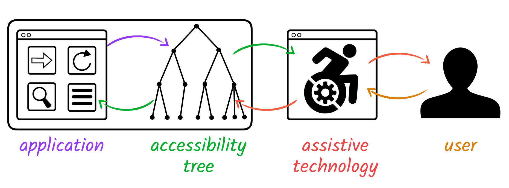
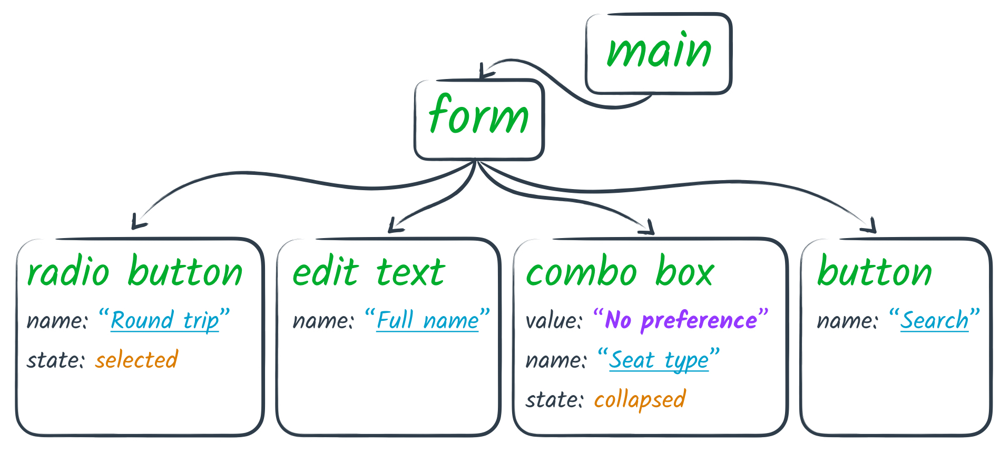
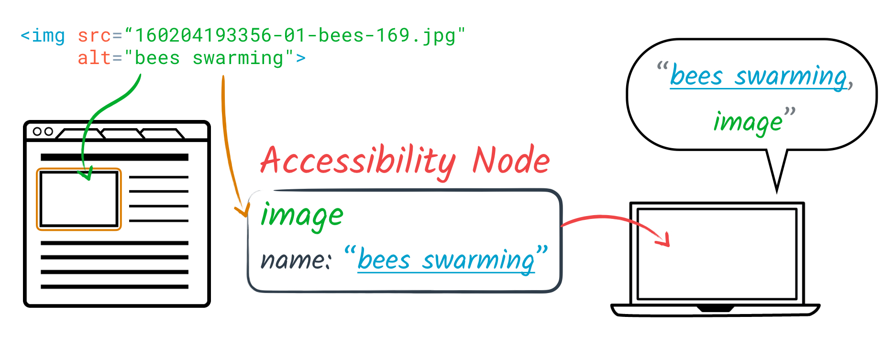
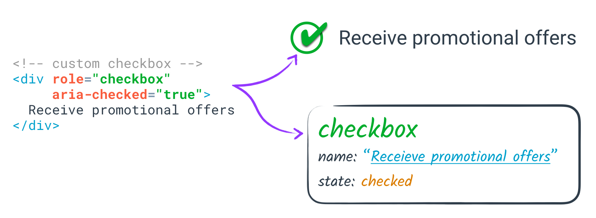

# Accessibility Object Model

**Editors:**

* Alice Boxhall, Google, aboxhall@google.com
* Bogdan Brinza, Microsoft, bbrinza@microsoft.com
* James Craig, Apple, jcraig@apple.com
* Dominic Mazzoni, Google, dmazzoni@google.com
* Cynthia Shelley, Microsoft, cyns@microsoft.com
* Alexander Surkov, Mozilla, surkov.alexander@gmail.com

<!-- START doctoc generated TOC please keep comment here to allow auto update -->
<!-- DON'T EDIT THIS SECTION, INSTEAD RE-RUN doctoc TO UPDATE -->
**Table of Contents**

- [Background: assistive technology and the accessibility tree](#background-assistive-technology-and-the-accessibility-tree)
  - [Accessibility node properties](#accessibility-node-properties)
- [Existing accessibility APIs](#existing-accessibility-apis)
  - [Native platform accessibility APIs](#native-platform-accessibility-apis)
  - [Gaps in the web platform's accessibility story](#gaps-in-the-web-platforms-accessibility-story)
  - [Audience for the proposed API](#audience-for-the-proposed-api)
- [The Accessibility Object Model](#the-accessibility-object-model)
  - [Exploring the accessibility tree](#exploring-the-accessibility-tree)
  - [Modifying the accessibility tree](#modifying-the-accessibility-tree)
    - [Rearranging the tree](#rearranging-the-tree)
    - [Virtual accessibility nodes](#virtual-accessibility-nodes)
- [Use cases](#use-cases)
  - [Use DOM node references instead of IDREFs](#use-dom-node-references-instead-of-idrefs)
    - [Example code](#example-code)
  - [Create virtual accessibility trees](#create-virtual-accessibility-trees)
    - [Example code](#example-code-1)

<!-- END doctoc generated TOC please keep comment here to allow auto update -->

## Background: assistive technology and the accessibility tree

Assistive technology, in this context, refers to a third party application
which augments or replaces the existing UI for an application.
One well-known example is a screen reader,
which replaces the visual UI and pointer-based UI
with an auditory output (speech and tones)
and a keyboard and/or gesture-based input mechanism,
completely separate from any audio output or keyboard or gesture input handled by the app.

Many assistive technologies interact with a web page via accessibility APIs, such as
[UIAutomation](https://msdn.microsoft.com/en-us/library/windows/desktop/ee684009.aspx)
on Windows, or
[NSAccessibility](https://developer.apple.com/library/mac/documentation/AppKit/Reference/NSAccessibility_Protocol_Reference/)
on OS X.
These APIs allow an application to expose a tree of objects representing the application's interface,
typically with the root node representing the application window,
with various levels of grouping node descendants down to individual interactive elements.
This is referred to as the **accessibility tree**.

An assistive technology user interacts with the application almost exclusively via this API,
as the assistive technology uses it both to create the alternative interface,
and to route user interaction events triggered by the user's commands to the assistive technology.



For example, a [VoiceOver](https://www.apple.com/voiceover/info/guide/) user might press the key combination
"Control Option Spacebar" to indicate that they wish to click the element which the screen reader is currently visiting.
These keypresses would never be passed to the application,
but would be interpreted by the screen reader,
which would then call the `accessibilityPerformPress()` function on the element via the API.
This is then routed back to the DOM as a `click` event by the browser.

In addition to screen readers, there's a variety of other types of assistive
technology that uses the same accessibility APIs, including *magnifiers*
for users with low vision, and both *switch access* and *voice control* software
for users with a motor impairment.

Accessibility APIs are also popular for testing and automation.
They provide a way to examine an application's state and manipulate its UI
from out-of-process, in a robust and comprehensive way. While assistive
technology for users with disabilities is typically the primary motivator for
accessibility APIs, it's important to understand that these APIs are quite general
and have many other uses.

### Accessibility node properties

Each node in the accessibility tree may be referred to as an **accessibility node**.
An accessibility node always has a **role**, indicating its semantic purpose.
This may be a grouping role,
indicating that this node merely exists to contain and group other nodes,
or it may be an interactive role,
such as `"button"`.



The user, via assistive technology, may explore the accessibility tree at various levels.
They may interact with grouping nodes,
such as a landmark element which helps a user navigate sections of the page,
or they may interact with interactive nodes,
such as a button.
In both of these cases,
the node will usually need to have a **label** (often referred to as a **name**)
to indicate the node's purpose in context.
For example, a button may have a label of "Ok" or "Menu".

Accessibility nodes may also have other properties,
such as the current **value** (e.g. `"10"` for a range, or `"Jane"` for a text input),
or **state** information (e.g. `"checked"` for a checkbox, or `"focused"`).

Interactive accessibility nodes may also have certain **actions** which may be performed on them.
For example, a button may expose a `"press"` action, and a slider may expose
`"increment"` and `"decrement"` actions.

These properties and actions are referred to as the *semantics* of a node.

## Existing accessibility APIs

The web has rich support for making applications accessible,
but only via a *declarative* API.

Native HTML elements are implicitly mapped to accessibility APIs.
For example, an  `` element will automatically be mapped
to an accessibility node with a role of `"image"`
and a label based on the `alt` attribute (if present).



Alternatively, [ARIA](https://www.w3.org/TR/wai-aria-1.1/)
allows developers to annotate elements with attributes to override
the default role and semantic properties of an element -
but not to expose any accessible actions.



In either case there's a one-to-one correspondence between a DOM node and a node in the accessibility tree,
and there is minimal fine-grained control over the semantics of the corresponding accessibility node.

### Native platform accessibility APIs

When building a native app, developers have the option of using native platform
accessibility APIs, such as
[UIAutomation](https://msdn.microsoft.com/en-us/library/windows/desktop/ee684009.aspx)
on Windows, or
[NSAccessibility](https://developer.apple.com/library/mac/documentation/AppKit/Reference/NSAccessibility_Protocol_Reference/)
on OS X, as mentioned above.

These platform accessibility APIs also make it straightforward to achieve the most common tasks,
such as adding an accessible text label for an image,
but, where necessary, have the power to give the developer total control over optimizing the accessible experience.

For example, an Android application developer may use the standard Android components,
which will expose the correct semantics and bounding boxes for touch exploration,
and have simple hooks for setting the accessible name.

However, if they are creating a fully-customised user interface,
the framework gives them the ability to create a
[virtual view hierarchy](https://developer.android.com/guide/topics/ui/accessibility/apps.html#virtual-hierarchy),
effectively exposing a sub-tree of accessibility nodes for a single, complex view.

### Gaps in the web platform's accessibility story

Since the web is missing this type of low-level API, it leads to significant gaps.
Web apps that push the boundaries of what's possible on the web struggle to make them accessible
because the APIs aren't yet sufficient.
New web platform features aren't fully accessible
or don't interact well with existing accessibility APIs,
forcing developers to choose between using new standard or remaining accessible.

* A library author creating a custom element is forced to "sprout" ARIA attributes
to express semantics which are implicit for native elements.

```html
<!-- Page author uses the custom element as they would a native element -->
<custom-slider min="0" max="5" value="3"></custom-slider>

<!-- Custom element is forced to "sprout" extra attributes to express semantics -->
<custom-slider min="0" max="5" value="3" role="slider"
               tabindex="0" aria-valuemin="0" aria-valuemax="5"
               aria-valuenow="3" aria-valuetext="3"></custom-slider>
```

* Moreover, there is no way to connect custom HTML elements to accessible actions.
For example, the custom slider above with a role of `slider`
prompts a suggestion on VoiceOver for iOS
to perform swipe gestures to increment or decrement,
but there is no way to handle that gesture via the DOM API.

* Many ARIA relationship properties depend on IDREFs,
meaning that elements participating in these relationship must have globally unique IDs.
This is ugly, costly and fiddly to achieve,
particularly in the context of framework or library code.

* A custom element which uses shadow DOM
and which needs to express semantic relationships such as
["active descendant"](https://www.w3.org/TR/wai-aria-1.1/#aria-activedescendant)
may be unable to do so, as `aria-activedescendant` relies on IDREF values,
which are scoped to a single document fragment.

```html
<x-combobox>
  #shadow-root
  |  <!-- this doesn't work! -->
  |  <input aria-activedescendant="opt1"></input>
  <x-optionlist>
    <x-option id="opt1">Option 1</x-option>
    <x-option id="opt2">Option 2</x-option>
    <x-option id='opt3'>Option 3</x-option>
 </x-optionlist>
</x-combobox>

```


A low-level API would bridge these gap,
allowing authors to bypass artificial limitations or bugs in the platform
and provide a custom accessible experience where necessary.

### Audience for the proposed API

We don't expect or encourage the average web developer
to want or need a low-level accessibility API for most things.
Declarative HTML should be sufficient for most web page authors.

This API is aimed at the relatively small number of developers who create and maintain
the JavaScript frameworks and widget libraries that power the vast majority of web apps.
Accessibility is a key goal of most of these frameworks and libraries,
as they need to be usable in as broad a variety of contexts as possible.
A low-level API would allow them to work around bugs and limitations
and provide a clean high-level interface that "just works" for the developers who use their components.

This API is also aimed at developers of large flagship web apps that
push the boundaries of the web platform. These apps tend to have large
development teams who look for unique opportunities to improve performance
using low-level APIs like Canvas. These development teams have the
resources to make accessibility a priority too, but existing APIs make it
very cumbersome.

## The Accessibility Object Model

This spec proposes the *Accessibility Object Model*,
a new API that makes it possible to:

1. explore the accessibility tree automatically generated by the browser from the DOM,
2. modify the accessibility tree to change what's exposed to assistive technology, and
3. directly respond to messages from assistive technology.

In the following sections we'll explore each of these major categories of functionality
and how we propose the accessibility API would work.

### Exploring the accessibility tree

The most basic thing that's possible using the proposed Accessibility Object Model
is exploring and querying the existing accessibility tree.

With the AOM, every DOM node has a property **`accessibleNode`**
that accesses that element's corresponding object in the accessibility tree,
if it has one.
Most DOM nodes will have an accessible node, with a few exceptions -
an element might not have an accessible node if it's not currently attached to a visible Document,
or if it's not currently displayed, for example.

Accessing an element's accessible node allows you to determine its role.
This example shows how you could figure out the role assigned to an HTML INPUT element with a type of "range":

```html
<label>
  Rating:
  <input id="myinput" type="range" value="5" min="1" max="10">
</label>
<script>
  var input = document.querySelector("#myinput");
  var axInput = input.accessibleNode;
  axInput.role;  // returns "slider"
</script>
```

The set of roles returned `AccessibleNode.role` is exactly the set of
ARIA roles. The Accessibility Object Model doesn't define any new semantics,
it just provides programmatic access to the role computation that was
previously not exposed to developers.

For nearly every ARIA attributes, there is a corresponding property on an `AccessibleNode` object
with the same semantics. (The few exceptions will be discussed below.)
In this particular case, we can access
the min, max, and current value of the slider
and its text label, among other things.

```js
axInput.rangeValue;  // returns 5.0
axInput.rangeMin;    // returns 1.0
axInput.rangeMax;    // returns 10.0
axInput.label;       // returns "Rating:"
```

To reiterate, the important thing to keep in mind is that the AOM doesn't add any
new vocabulary or semantics; all of the properties are concepts that
already exist in ARIA or other parts of existing web specifications.
The only thing that's new is providing a functional, as opposed to a
declarative, interface.

The AOM can be used as a form of feature detection and validation, in
particular when using ARIA attributes. For example, we can set an
element's role and see what role is returned in the AOM.

```js
var element = document.createElement("article");
element.accessibleNode.role;  // returns "article" because that's a valid ARIA role

element.setAttribute("role", "toolbar");
element.accessibleNode.role;  // returns "toolbar" because that's a valid ARIA role

element.setAttribute("role", "feed");  // new ARIA 1.1 role
element.accessibleNode.role;  // returns "feed" if supported by the user agent

element.setAttribute("role", "butler");
element.accessibleNode.role;  // returns "article" because "butler" is not a valid role
```

**Open question:**
What should be returned when a node's role does not correspond to an ARIA role?
For example, the HTML **`P`** element is semantically important, and on many
platforms there's a native accessibility role for a paragraph, but there's no
corresponding "paragraph" ARIA role. Options include returning an internal
non-standardized role like "x-paragraph" that may differ by user agent,
or extending the list of roles supported by the AOM to include many non-ARIA roles.

In addition to examining the properties of an individual node, you can
explore an accessible node's relationships with other nodes in the tree.
Just like nodes in the DOM, every accessible node has a parent (unless
it's the root of the tree), and it can have any number of children.

```html
<ol id="list1">
  <li>The Original Series</li>
  <li>The Next Generation</li>
  <li>Deep Space Nine</li>
  <li>Voyager</li>
  <li>Enterprise</li>
</ol>
<script>
  var axList = document.getElementById("list1").accessibleElement;
  var axItem1 = axList.children[0];
  var axItem2 = axList.children[1];
  axItem1.parent == axList;  // returns true;
</script>
```

In addition to **`parent`** and **`children`**, accessible nodes
have relationships like **`activeDescendant`**, which expresses a
relationship between a container element (like a listbox) and its
active child, or **`labelFor`**, which expresses a relationship
between a label and the control that it labels.

### Modifying the accessibility tree

So far we've just seen ways the AOM makes it possible to introspect
and explore the accessibility tree via JavaScript. This is definitely
interesting for use cases such as testing and feature detection,
but it doesn't really add any significant capabilities to the web
platform. The next major category of functionality the AOM enables is
modifying the accessibility tree, and that's where it starts to address
major developer pain points and bridge many gaps in the current platform.

Nearly all properties on an accessible node can be written, not just read.
For example, we could take the slider as in the example above and give it
a role of "scrollbar" instead, and change its accessible label.

```html
<label>
  Rating:
  <input id="myinput" type="range" value="5" min="1" max="10">
</label>
<script>
  var input = document.querySelector("#myinput");
  var axInput = input.accessibleNode;
  axInput.role = "scrollbar";
  axInput.label = "User rating";
</script>
```

Setting a property of an accessible node immediately has an
effect on the accessibility tree. For example, if any assistive
technology was currently examining the user agent, it would
quickly receive a notification that an attribute of an object
within the web page had changed, and upon retrieving that object
it'd get the new value of those properties.

Just as with ARIA, changing properties of accessible nodes has no
effect on the look or feel of the webpage in any other way. Only
clients of that platform's accessibility API are affected.

One very important design decision in the AOM is what should happen
when trying to set the value of an accessible property to
something illegal (such as a role name that doesn't exist).
Possible options include:

* Doing no error checking, all values would be allowed for accessibility
  properties, but some would just have no effect.
* Raising an exception immediately upon trying to set an accessibility
  property to an illegal value
* Ignoring attemps to set an accessibility property to an illegal value.

However, one important consideration is that whether or not a value is
legal or not often depends on the context.

For example, the **`checked`** property is only defined on
accessible nodes with certain roles like **`checkbox`** and **`radio`**.
Therefore it's illegal to try to set **`checked`** on an object with a
role where it isn't defined, like **`heading`**. However, it seems like
it would be unfortunate if setting `checked=true` and then setting
`role="checkbox"` would fail, while doing it in the other order would
succeed.

So instead, we propose the following rule:

**When setting the value of an accessible property, that value is
preserved in the accessible node's internal state. At the time the
accessible property is accessed, illegal values are ignored.**

First let's see an example of how that applies in practice when
trying to set a role.

```js
var heading = document.createElement("h1");
var axHeading = heading.accessibleNode;
axHeading.role;  // returns "heading"

axHeading.role = "button";
axHeading.role;  // returns "button" because that's a legal role

axHeading.role = "captain";
axHeading.role;  // returns "heading" because "captain" is not legal.
```

If ARIA attributes are used, the same behavior applies, in that
accessing the **`role`** property returns the *computed* property
value, which is taken from the accessible node first, from the
ARIA attribute second, and from the HTML element's native semantics
third.

```js
var textbox = document.createElement("input");
var axTextbox = textbox.accessibleNode;
axTextbox.role;  // returns "textbox"

textbox.setAttribute("role", "combobox");
axTextbox.role;  // returns "combobox"

textbox.setAttribute("role", "victim");
axTextbox.role;  // returns "textbox" because "victim" is not legal.

textbox.setAttribute("role", "combobox");
axTextbox.role = "searchbox";
axTextbox.role;  // returns "searchbox" because the AOM overrides ARIA.
```

Note that one design decision we made here is that properties set on
an accessible node are not reflected in the HTML element, for example:

```js
var link = document.createElement("a");
var axLink = link.accessibleNode;
axLink.role = "button";
link.getAttribute("role");  // returns "link", because the AOM role is not reflected
```

There are a couple of reasons we feel this is the right solution.

* Most importantly, some attributes of accessible nodes can't always
  be reflected - in particular relationship attributes.
  In the AOM you can use **`labeledBy`** to establish a relationship
  between one node and any other node that provides its label,
  whereas in ARIA the `aria-labelledby` attribute is limited to
  elements it can reference by unique ID.
* Also, adding lots of ARIA attributes to the DOM can be a performance issue,
  especially for interactive web apps with thousands of elements.
  Using the AOM has the potential to be a more lightweight way to make
  apps accessible.

A side benefit of this approach is that feature detection is especially easy.
To determine if the browser supports a certain role, just set any accessible
node's role to that string and see if it's returned back when accessing it.
While not an explicit goal, it does seem useful.

#### Rearranging the tree

In addition to changing properties of a single accessible node, you can
also make changes to the relationships between multiple accessible nodes,
including the parent/child relationships that form the tree structure.

When modifying a relationship property, the change is reflected in the
accessibility tree synchronously. If a node is attached as the new child
or parent of another node, it's automatically detached from its previous
child or parent first. That makes cycles impossible, because trying to
conncet nodes in a way that would form a cycle would just break some
other link in the cycle first.

Here are some examples:

```js
axNode1.children.append(axNode2);
```

This statement makes axNode2 the last child of axNode1.
If axNode2 was previously somewhere else in the accessibility
tree, it's first detached from its previous parent before being
added here. If axNode2 was previously already a child of
axNode1, but not the last child, this would make it the last
child.

```js
axNode2.parent = axNode1;
```

This statement has the same effect in most cases: if axNode2
was not previously a child of axNode1, it gets detached from
its previous parent, if any, and attached as the last child of
axNode1.

However, unlike the statement above, if axNode2 was already a
child of axNode1, this wouldn't rearrange it.
If axNode2 was previously somewhere else in the accessibility
tree, it's first detached from its previous parent before being
added here.

Trying to set the parent or child to an illegal value throws an
exception.

Trying to reparent the root of the accessibility tree for a frame
throws an exception. The root of the tree can be modified in most
other ways but it can't be entirely removed.

Note that changing the accessibility tree happens completely
independently of the DOM tree.

**Open question:**
What should happen if the DOM tree changes and it affects
accessible nodes that have already been rearranged in the
accessibility tree?

#### Virtual accessibility nodes

So far we've looked into how to modify existing accessible nodes
corresponding to DOM nodes, and even rearrange them in the
accessibility tree.

The AOM also makes it possible to create new *virtual* accessible
nodes that don't correspond to DOM elements. This makes it possible
to represent objects on the screen that don't correspond to DOM
elements but semantically represent real objects.

## Use cases

### Use DOM node references instead of IDREFs
Some HTML and ARIA features require reference to another element by IDREF,
but it's problematic in some contexts to require the accessibility code to generate IDs.
For example, some JS frameworks generated IDs automatically
and make maintaining the value of those IDs purposefully obtuse.
Likewise, in some extremes cases,
the expectation of IDREFs requires generating thousands of DOM modifications
which can lead to serious performance problems in the application.

Moreover, IDREFs cannot cross over Shadow DOM boundaries,
so any case which requires an ARIA relationship across these boundaries cannot be implemented today

This API would allow authors to associate related elements using a JavaScript object reference.

#### Example code

```html
<x-combobox>
  <x-optionlist>
    <x-option>Option 1</x-option>
    <x-option>Option 2</x-option>
    <x-option>Option 3</x-option>
 </x-optionlist>
</x-combobox>
```

```js
var combobox = document.querySelector('x-combobox');
var shadowRoot = combobox.createShadowRoot();
var input = document.createElement('input');
shadowRoot.appendChild(input);

var option1 = combobox.querySelectorAll('x-option')[0];
var axInput = input.accessibleNode;
var axOption1 = option1.accessibleNode;
axInput.activeDescendant = axOption1;
```

### Create virtual accessibility trees

Some authors create web interfaces using an HTML Canvas or some other direct-drawing API to render an interface
instead of using native HTML elements.

Currently the only way to make this type of solution accessible
is by creating hidden DOM elements for accessibility,
either as part of the Canvas fallback content,
or just with DOM elements placed behind the visual UI in the Z-order.
This is an ugly hack and it's wasteful,
as there's a lot of overhead to adding DOM elements to the page -
it impacts layout, style resolution, etc.

Instead, this API makes it possible to create virtual accessibility objects
for a portion of a page's accessibility tree.

#### Example code

```js
var canvas = document.querySelector('canvas');

// ... draw UI into canvas ...

var axRoot = canvas.accessibleNode;

var axOkButton = new AccesibleNode("button");
axOkButton.label = "Ok";
axOkButton.offsetWidth = /* width of canvas-drawn button, and similarly below */ 40;
axOkButton.offsetHeight = 10;
axOkButton.offsetLeft = 50;
axOkButton.offsetTop = 40;
// canvas already listens for click event within these coordinates, so fallback click event will do the job for us

axRoot.children.append(axOkButton);

var axCancelButton = new AccesibleNode("button");
axCancelButton.label = "Cancel";
axCancelButton.offsetWidth = /* width of canvas-drawn button, and similarly below */ 40;
axCancelButton.offsetHeight = 10;
axCancelButton.offsetLeft = 100;
axCancelButton.offsetTop = 40;

axRoot.children.append(axCancelButton);

```

## Next Steps

The Accessibility Object Model development is led by a team of editors
that represent all of the major browser vendors. The spec still needs
a lot of work, but we have already achieved broad consensus on the overall
approach and scope, and we intend to ship preliminary implementation
(behind a flag) in multiple browsers before the end of 2016.

An early draft of the spec is available here:

http://a11y-api.github.io/a11y-api/spec/

The spec has several rough edges. Please refer to this explainer to understand
the motivation, reasoning, and design tradeoffs. The spec will continue to
evolve as we clarify the ideas and work out corner cases.

Issues can be filed on GitHub:

https://github.com/a11y-api/a11y-api/issues

### Incubation

We intend to continue development of this spec as part of the
[Web Platform Incubator Community Group (WICG)](https://www.w3.org/community/wicg/).
Over time it may move into its own community group.

Our intent is for this group's work to be almost entirely orthogonal to the
current work of the [Web Accessibility Initiative](https://www.w3.org/WAI/)
groups such as [ARIA](https://www.w3.org/TR/wai-aria/). While ARIA defines
structural markup and semantics for accessibility properties on the web,
often requiring coordination with assistive technology vendors and native platform
APIs, the AOM simply provides a parallel JavaScript API that provides
more low-level control for developers and fills in gaps in the web platform,
but without introducing any new semantics.

## Additional thanks

Many thanks for valuable feedback, advice, and tools from:

* Alex Russell
* David Bolter
* Domenic Denicola
* Ian Hickson
* Joanmarie Diggs
* Marcos Caceres
* Nan Wang
* Robin Berjon
